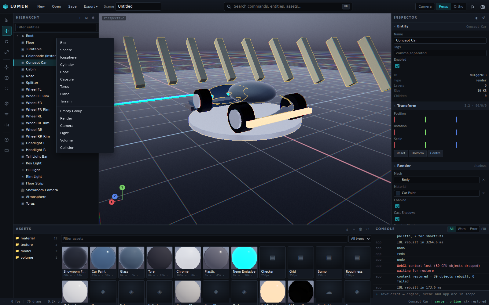

# Lumen Studio

[](https://github.com/hazem-soussi-HA/lumen-studio/actions/workflows/ci.yml)
[](https://hazem-soussi-HA.github.io/lumen-studio/)
[](#licence)
[](https://registry.khronos.org/webgl/specs/latest/2.0/)

### **[▶ Try it in the browser](https://hazem-soussi-HA.github.io/lumen-studio/)** — no install, no build

A browser-native 3D engine **and** editor, written directly against WebGL / OpenGL ES.
No engine, no framework, no bundler, no build step: `index.html` loads ES modules and
the browser resolves the dependency graph.



* **WebGL 2 first, WebGL 1 second.** One neutral GLSL source tree compiles to both
  GLSL ES 3.00 and 1.00 through a transpiler (`src/gl/program.js`).
* **Physically based forward rendering** — Cook-Torrance GGX, 2-cascade directional
  shadows, image-based lighting, SSAO, bloom, FXAA, ACES tone mapping.
* **A real editor** — hierarchy, inspector, asset browser with GPU-rendered previews,
  transform gizmo, command palette, undo/redo, console, stats, JSON project I/O.
* **Selection by id buffer** — no readback of the colour buffer, no raycast against
  mesh geometry: one pixel of a dedicated id target is read per click.
* **Degrades honestly.** A software rasteriser gets a smaller budget, not a broken
  frame: see the tier table below.

---

## Why this might interest you

Written for people who read frame graphs for fun.

* **The WebGL footgun log.** [`docs/WEBGL-ARTICLE-MAP.md`](docs/WEBGL-ARTICLE-MAP.md)
  is a table of *concept → file → the concrete failure that taught the lesson*, from
  `texImage2D(TEXTURE_CUBE_MAP)` throwing `INVALID_ENUM` to a VAO reused across
  programs silently corrupting an attribute layout. Every "gotcha" in it actually
  happened here and is now covered by a check in the test suite. It is the fastest
  way to get oriented in a codebase with no build step.
* **One GLSL tree, two dialects.** Not two shader sets kept in sync by hand — a
  transpiler with an authored-rule set that the linter enforces, so the two outputs
  cannot drift.
* **Budgets derived from measurements, not from user-agent strings.** One capability
  report scores a tier that drives shadow resolution, MSAA, DPR, post passes and light
  limits. The CI suite runs entirely on a CPU rasteriser and still asserts a correct
  frame.
* **Deterministic verification.** 31 end-to-end checks drive the real editor in
  headless Chrome: id-buffer picking on an instanced entity, gizmo hit testing,
  context loss and restore, undo/redo, and a hard failure on *any* console error.

---

## Running it

```bash
npm install          # puppeteer-core only; needed for the tests, not to serve
npm start            # http://localhost:8080
npm run dev          # same, with an explicit port
```

The server is a ~200-line static file server with no dependencies. Any static server
works; the only requirement is that `.glsl`, `.obj`, `.gltf` and friends are served
with a sensible content type.

It binds **loopback only** by default. The `/api/projects` endpoints have no
authentication and answer CORS permissively, so `--host 0.0.0.0` is opt-in and prints a
warning — do not use it on a network you do not control.

```bash
npm test             # headless Chrome smoke test (31 checks)
npm run lint         # syntax, import graph, GLSL authoring rules, house style
node tools/shot.mjs  # screenshot the 3D viewport to test/output/viewport.png
```

The tests need a Chrome binary:

```bash
npx @puppeteer/browsers install chrome@stable
```

It lands in `./chrome/` and is picked up automatically. The smoke test runs with
`--enable-unsafe-swiftshader`, so it passes on a machine with no GPU at all.

## Controls

| | |
|---|---|
| Select | `Q`, or click in the viewport |
| Orbit / Pan / Zoom | middle-drag, `Alt`+drag, wheel |
| Move / Rotate / Scale | `W` / `E` / `R`, then drag a gizmo handle |
| Frame selection | `F` · zoom to fit `Z` |
| Undo / Redo | `Ctrl+Z` / `Ctrl+Shift+Z` |
| Command palette | `Ctrl+K` |
| Import | drop `.obj` / `.stl` / `.gltf` onto the window |

Every one of those is a named command in the registry (`src/editor/editor.js`), so it
shows up in the palette with its keybinding — there is no hidden keyboard handling.

---

## What is in the box

```
src/
  core/        maths (vec/mat/quat/aabb/frustum/colour), commands, undo history,
               logger, storage, misc utilities
  gl/          the WebGL layer: context, capabilities, buffers, VAOs, meshes,
               instance streams, textures, framebuffers/render targets, program
               cache + GLSL transpiler, and the shader library
  render/      camera, forward renderer + frame graph, cascaded shadows, IBL
  scene/       entities & transforms, components, materials, assets, primitives
  loaders/     OBJ, STL, glTF 2.0
  editor/      the editor shell: viewport, hierarchy, inspector, assets, gizmo,
               overlays, console, widgets, CSS
  scenes/      the demo showroom
```

~14.6k lines of JavaScript and GLSL. Design notes and the reasoning behind the frame
graph are in [`docs/ARCHITECTURE.md`](docs/ARCHITECTURE.md); the mapping from WebGL
concepts to the code that implements them is in
[`docs/WEBGL-ARTICLE-MAP.md`](docs/WEBGL-ARTICLE-MAP.md).

## The frame graph

One camera priority picks the active camera; the renderer then runs, in order:

1. **shadow cascades** — 2 splits, depth-only pass into `DEPTH_COMPONENT24` textures
   sampled with hardware comparison filtering
2. **background** — analytic sky, or the camera clear colour
3. **opaque** — sorted front to back, instanced requests merged by (mesh, material,
   layout, spread) into a single draw call each
4. **SSAO** — from the depth buffer, blurred, multiplied into ambient
5. **transparent** — back to front, depth-write off
6. **volumes** — ray-marched fog inside a bounds mesh
7. **grid / helpers / gizmos** — screen-space and immediate-mode overlays
8. **post** — bloom downsample chain, then composite: tonemap → sRGB → grade →
   vignette → grain → FXAA
9. **id buffer** — only when the scene is dirty or a pick forces it

Render targets are sized from the canvas element box, not the window, because the
editor layout — grid columns, draggable splitters, collapsible panels — changes the
canvas without ever firing a `resize` event.

## Quality tiers

The adapter is scored once, from the context version, extension registry, driver
limits and the unmasked renderer string (`src/gl/capabilities.js`). Nothing anywhere
sniffs for a browser name.

| tier | score | shadow map | MSAA | max DPR | bloom | SSAO | IBL | max lights |
|---|---|---|---|---|---|---|---|---|
| ultra | ≥70 | 2048 | 4× | 2 | ✓ | ✓ | ✓ | 32 |
| high | ≥50 | 2048 | 4× | 2 | ✓ | ✓ | ✓ | 24 |
| medium | ≥32 | 1024 | 2× | 1.5 | ✓ | — | ✓ | 16 |
| low | — | 1024 | — | 1 | — | — | — | 8 |
| software | — | 1024 | — | 1 | — | — | — | 8 |

`software` is any adapter whose unmasked renderer identifies a CPU rasteriser
(SwiftShader, llvmpipe, "Microsoft Basic Render Driver"). The smoke test runs in that
tier and still renders a correct frame.

## Known limits

* Shadows are directional (2 cascades) and unfiltered beyond hardware PCF. Point and
  spot lights cast no shadow.
* The volume renderer marches a single 3D texture — no froxels, no temporal reuse.
* Skinning, morph targets, particle systems and a physics step are not implemented;
  the loaders import static geometry only.
* `EXT_disjoint_timer_query` is detected but GPU timing is not yet plumbed into the
  stats panel.
* The editor is single-window; drag-and-drop import and JSON project files are the
  persistence story, not a cloud backend.

## Licence

[MIT](LICENSE) © Hazem Soussi.

## Contributing

Issues and pull requests are welcome — see [CONTRIBUTING.md](CONTRIBUTING.md) for
the constraints this project works within, and [SECURITY.md](SECURITY.md) for
reporting a vulnerability.
